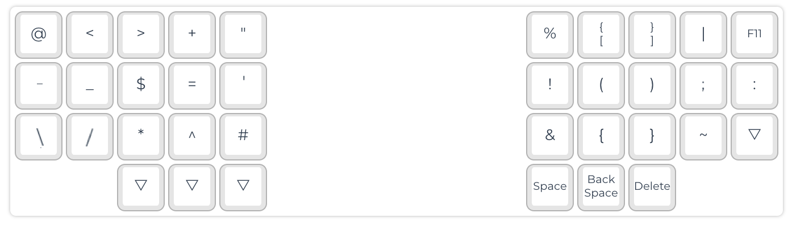

# Miryoku QMK Development Layer
** This replaces the [Miryoku](https://github.com/manna-harbour/miryoku) Mouse layer to a developer friendly layer:


### Build

* Follow the [Miryoku QMK build steps](https://github.com/manna-harbour/miryoku_qmk/tree/miryoku/users/manna-harbour_miryoku).
until the compiling step.

* Insert into the file `qmk_firmware/users/manna-harbour_miryoku/custom_config.h`
```
#pragma once

#define MIRYOKU_LAYER_MOUSE \
KC_AT,             KC_LABK,           KC_RABK,           KC_PLUS,           KC_DQUO,           KC_PERC,           KC_LBRC,               KC_RBRC,               KC_PIPE,           KC_F11,             \
KC_EXLM,           KC_MINS,           KC_UNDS,           KC_EQL,            KC_QUOT,           KC_DLR,            KC_LPRN,               KC_RPRN,               KC_COLN,           KC_AMPR,            \
U_NA,              KC_SLSH,           KC_ASTR,           KC_CIRC,           KC_HASH,           KC_BSLS,           KC_LCBR,               KC_RCBR,               KC_TILD,           U_NA,               \
U_NP,              U_NP,              U_NA,              U_NA,              U_NA,              KC_SPC,            KC_BSPC,               KC_DEL,                U_NP,              U_NP
```

* Compile

See Miryoku compile steps as the following may not fit for you.

```
qmk compile -c -kb crkbd -km manna-harbour_miryoku -e MIRYOKU_EXTRA=COLEMAKDH
```


### Installation
Following may differ for you - I'm using a corne board with elite-c.

* Open QMK Toolbox
* Select ATmega32U4
* Select compiled file: `./qmk_firmware/crkbd_rev1_manna-harbour_miryoku.hex`
* Connect left keyboard side and press the connect button.
* QMK Toolbox should show a connected message. Click "Flash".
* Wait until flash completes and QMK Toolbox confirms the disconnect.
* Connect right keyboard side and press the connect button.
* QMK Toolbox should show a connected message. Click "Flash".
* Wait until flash completes and QMK Toolbox confirms the disconnect.
* Done.

